# Proyecto_2
## Estudiantes:
Daniel Montero

José Guerrero

## Introducción

Este proyecto consiste en el diseño e implementación de un sistema digital sincrónico en SystemVerilog para una FPGA Tang Nano 9K. El sistema en resumidas cuentas funciona como una calculadora sencilla que puede capturar datos desde un teclado matricial hexadecimal, procesarlos internamente y mostrar el resultado en un display de 7 segmentos.

## Definición del problema y objetivos y especificaciones

El problema consiste en diseñar un circuito digital que permita ingresar dos números mediante un teclado hexadecimal, realizar su suma y desplegar el resultado en un display de 7 segmentos.

El objetivo principal es aplicar conceptos de diseño digital sincrónico en HDL, incluyendo lectura de entradas externas, debouncer, sincronización, almacenamiento de datos, suma aritmética y multiplexado de displays.

Las especificaciones principales del sistema son:

- Implementación en SystemVerilog.
- Uso de la FPGA Tang Nano 9K.
- Reloj principal de 27 MHz.
- Entrada mediante teclado matricial hexadecimal.
- Captura de dos números.
- Suma aritmética en formato BCD.
- Visualización en un display de 7 segmentos.

## 1.Abreviaturas:

-**FPGA**: Field Programable Gate Arrays

-**rst**: reset

-**clk**: clock

-**BCD**:  Binary-Coded Decimal

-**bin**: Binary


## 2. Desarrollo
### 2.0 Descripción general del sistema
Se solicita el desarrollo de un circuito que capture dos números enteros positivos de al menos tres dígitos
decimales cada uno, a partir de un teclado hexadecimal y que despliegue la suma sin signo de los mismos en
cuatro dispositivos de 7 segmentos. El mismo deberá construirse según las pautas fundamentales de diseño
digital sincrónico.

### 2.1 Módulo clk_divider
```systemverilog
module clk_divider (
    input  logic clk,    // Reloj maestro de entrada (referencia de alta velocidad)
    input  logic rst,    // Reset asíncrono para inicializar el contador
    output logic tick    // Pulso de salida sincronizado que indica el desborde
);
    // Registro de 14 bits para el conteo de ciclos de reloj
    logic [13:0] count;

    // Lógica secuencial para el incremento del contador
    always_ff @(posedge clk or posedge rst) begin
        if (rst) 
            count <= 14'd0;         // Reinicio del contador a su valor inicial
        else     
            count <= count + 1'b1;  // Incremento por cada flanco de subida
    end

    // Lógica combinacional para generar el pulso de habilitación.
    // Se activa por un solo ciclo de reloj maestro cada vez que el contador 
    // completa su ciclo de 2^14 estados.
    assign tick = (count == 14'd0);

endmodule

```
#### Descripción del módulo
El módulo clk_divider funciona mediante un contador progresivo constante, cuya tasa de desbordamiento es menor a la frecuencia de operación de la FPGA. Este divisor mantiene un conteo cíclico de los flancos de subida del reloj maestro que detecta cuándo el registro interno completa su capacidad máxima de estados. Este módulo genera una señal de un solo ciclo de duración (tick) que indica el desborde y sirve como pulso de habilitación periódica para sincronizar otros bloques del sistema.
  
#### Funcionamiento:
 El funcionamiento se basa en un ciclo de acumulación binaria síncrona continuo, donde un registro de 14 bits incrementa su valor unitario por cada flanco de subida de la señal clk tras ser inicializado por el bit de reinicio rst. A medida que el reloj maestro propaga sus pulsos, el acumulador progresa a través de sus estados lógicos hasta alcanzar su capacidad máxima de almacenamiento interno. En el instante exacto en que el contador se desborda y regresa de manera natural al valor de cero, una línea de lógica combinacional pura detecta esta condición de reinicio, conmutando de inmediato a un nivel alto para emitir el pulso de sincronía síncrona tick, repitiendo indefinidamente este ciclo para actuar como una base de tiempo periódica dentro del circuito general.

### 2.2 Módulo de control de ánodos

```systemverilog
module anode_control (
    input  logic clk,       // Reloj maestro del sistema
    input  logic rst,       // Reset asíncrono (activo en alto)
    input  logic tick,      // Habilitación de cambio de dígito (proveniente del divisor)
    output logic [1:0] sel, // Selector para el multiplexor de datos (0 a 3)
    output logic [3:0] anode // Salida física hacia los ánodos/cátodos del display
);
    always_ff @(posedge clk or posedge rst) begin
        if (rst) begin
            // Estado inicial: contador a cero y todos los ánodos apagados
            sel   <= 2'd0;
            anode <= 4'b0000;
        end else if (tick) begin
            // Se incrementa el selector para pasar al siguiente dígito
            sel <= sel + 1'b1;
            
            // Decodificador de 2 a 4 bits: activa el pin físico correspondiente
            case (sel)
                2'd0: anode <= 4'b0001; // Activa Dígito 0 (Derecha)
                2'd1: anode <= 4'b0010; // Activa Dígito 1
                2'd2: anode <= 4'b0100; // Activa Dígito 2
                2'd3: anode <= 4'b1000; // Activa Dígito 3 (Izquierda)
            endcase
        end
    end
endmodule
```
#### Descripción del módulo
El módulo anode_control funciona mediante una conmutación cíclica constante, cuya velocidad de activación está determinada por la señal de habilitación externa tick. Este controlador mantiene una rotación secuencial de los dígitos activos en un bloque de displays de 7 segmentos, permitiendo el multiplexado en el tiempo para evitar el uso excesivo de pines en la FPGA. Este módulo genera una señal de selección binaria (sel) que sincroniza el multiplexor de datos y una señal de activación física (anode) que habilita el común del dígito correspondiente en cada instante.
#### Funcionamiento
El funcionamiento se basa en un ciclo continuo de conteo y decodificación síncrona gobernado por el reloj maestro, donde el sistema permanece estático hasta que la señal externa tick habilita un cambio de estado. En el momento en que este pulso se activa, un registro interno de 2 bits incrementa su valor de forma secuencial para actualizar el selector sel, el cual es utilizado inmediatamente por un decodificador síncrono para mapear la posición actual en una estructura one-hot. Esta lógica asigna un nivel alto a un único pin del bus de salida anode por cada flanco, encendiendo un display físico a la vez y desplazando el haz de luz de derecha a izquierda de manera cíclica para proyectar ordenadamente los cuatro caracteres del bloque a través del multiplexado temporal.
 ### 2.3 Módulo hexadecimal a 7 segmentos.
```systemverilog 
module hex_to_7seg (
    input  logic [3:0] hex, // Valor de 4 bits (0-F) a decodificar
    output logic [6:0] seg  // Bus de salida para los segmentos [g f e d c b a]
);
    // Lógica combinacional pura: traduce la entrada al patrón de ledes.
    always_comb begin
        unique case (hex)
            // Lógica Inversa: '0' enciende el segmento, '1' lo apaga
            // Formato: g f e d c b a
            4'h0: seg = 7'b1000000; // Muestra '0'
            4'h1: seg = 7'b1111001; // Muestra '1'
            4'h2: seg = 7'b0100100; // Muestra '2'
            4'h3: seg = 7'b0110000; // Muestra '3'
            4'h4: seg = 7'b0011001; // Muestra '4'
            4'h5: seg = 7'b0010010; // Muestra '5'
            4'h6: seg = 7'b0000010; // Muestra '6'
            4'h7: seg = 7'b1111000; // Muestra '7'
            4'h8: seg = 7'b0000000; // Muestra '8' (todos encendidos)
            4'h9: seg = 7'b0010000; // Muestra '9'
            4'hA: seg = 7'b0001000; // Muestra 'A'
            4'hB: seg = 7'b0000011; // Muestra 'b'
            4'hC: seg = 7'b1000110; // Muestra 'C'
            4'hD: seg = 7'b0100001; // Muestra 'd'
            4'hE: seg = 7'b0000110; // Muestra 'E'
            4'hF: seg = 7'b0001110; // Muestra 'F'
            default: seg = 7'b1111111; // Apagado total por seguridad
        endcase
    end
endmodule
```

#### Descripción del módulo
El módulo hex_to_7seg funciona mediante una decodificación puramente combinacional, cuya lógica de salida está configurada en formato de lógica inversa (ánodo común). Este decodificador mantiene una traducción directa de cualquier valor numérico de 4 bits ingresado en su entrada binaria que detecta cuando se requiere representar un dígito del sistema hexadecimal (0-F). Este módulo genera un patrón de encendido específico de 7 bits (seg) que indica cuáles segmentos del display físico deben activarse o desactivarse para reflejar visualmente el carácter correspondiente.

#### Funcionamiento
El funcionamiento se basa en una matriz de mapeo combinacional estática resuelta mediante una estructura de casos unívocos (unique case), evaluando en tiempo real el bus de entrada hex. Al ingresar un nibble binario, el circuito evalúa de forma paralela la condición y anula los retardos secuenciales para asignar de inmediato el mapa de bits equivalente al bus de salida seg. Debido a que el diseño está optimizado para pantallas de ánodo común, el sistema emplea una lógica inversa donde un cero lógico (0) drena la corriente necesaria para encender el led del segmento asignado (en el orden posicional g-f-e-d-c-b-a) y un uno lógico (1) lo mantiene en corte, garantizando además el apagado total de los diodos ante cualquier estado indeterminado en la entrada a través de la sentencia por defecto.


### 2.4 Módulo display.
```systemverilog 
module display (
    input  logic clk,           // Pin de reloj
    input  logic rst,           // Pin de reset
    input  logic [15:0] num_in, // Número completo a mostrar (ej. 16'hABCD)
    output logic [3:0]  enc_an, // Salida física a los ánodos/cátodos comunes
    output logic [6:0]  enc_seg // Salida física a los 7 segmentos del bus
);

    // Señales internas para interconectar los submódulos
    logic scan_tick;       // Cable que lleva el pulso del divisor
    logic [1:0] sel;       // Cable que indica el dígito activo
    logic [3:0] current_val; // Cable con el nibble que se va a decodificar

    // --- INSTANCIA 1: Generación de tiempo ---
    clk_divider timer (
        .clk(clk),
        .rst(rst),
        .tick(scan_tick)
    );

    // --- INSTANCIA 2: Control de selección de display ---
    anode_control controller (
        .clk(clk),
        .rst(rst),
        .tick(scan_tick),
        .sel(sel),
        .anode(enc_an)
    );

    // --- LÓGICA DE MULTIPLEXACIÓN ---
    // Dependiendo del valor de 'sel', extraemos 4 bits específicos de la entrada.
    // Esto asegura que el decodificador reciba el número correcto para el dígito activo.
    always_comb begin
        case (sel)
            2'd0: current_val = num_in[3:0];   // Dígito 0: bits menos significativos
            2'd1: current_val = num_in[7:4];   // Dígito 1
            2'd2: current_val = num_in[11:8];  // Dígito 2
            2'd3: current_val = num_in[15:12]; // Dígito 3: bits más significativos
            default: current_val = 4'h0;
        endcase
    end

    // --- INSTANCIA 3: Conversión a 7 segmentos ---
    hex_to_7seg decoder (
        .hex(current_val),
        .seg(enc_seg)
    );

endmodule
```

#### Descripción del módulo
El módulo display funciona mediante una arquitectura estructural de multiplexado temporal, cuya lógica integra y coordina múltiples submódulos internos para gestionar la visualización dinámica de datos. Este sistema mantiene una segmentación y un ruteo constante de un número binario de 16 bits que detecta cuál de los cuatro dígitos del bloque de displays debe encenderse en sincronía con su respectivo valor hexadecimal (nibble). Este módulo genera los vectores de salida físicos enc_an y enc_seg que indican de forma unificada la habilitación del ánodo o cátodo común y el patrón de segmentos correspondiente para representar visualmente el valor completo en la tarjeta de desarrollo.

#### Funcionamiento
El funcionamiento se basa en un ciclo continuo de división de tiempo y decodificación de datos, donde una base de tiempo interna marca el ritmo para alternar secuencialmente la activación de cada uno de los cuatro displays físicos a través de sus terminales comunes. En perfecta sincronía con esta conmutación, el circuito aísla de forma dinámica el fragmento de 4 bits que corresponde al dígito activo dentro de la palabra principal de 16 bits, traduciendo de inmediato ese valor binario al patrón eléctrico de segmentos requerido. Este proceso de selección, filtrado y proyección visual se repite de manera cíclica a una velocidad lo suficientemente alta como para aprovechar la persistencia de la visión, creando la ilusión óptica de que todos los dígitos se encuentran encendidos en simultáneo con sus datos correspondientes.


### 2.5 Módulo key scanner.
```systemverilog 
module key_scanner #(
    parameter SCAN_DIV = 15000 // Valor para ajustar la velocidad de escaneo
)(
    input  logic       clk,         // Reloj maestro del sistema
    input  logic       rst,         // Reset asíncrono
    input  logic       scan_enable, // Señal de habilitación para permitir el avance de fila
    output logic [1:0] scanned_row, // Índice de la fila actual para uso interno/decodificación
    output logic [3:0] row          // Salida física hacia los pines de las filas del teclado
);

    logic [15:0] scan_cnt; 
    logic scan_tick;

    // Lógica para generar el pulso de temporización de escaneo
    assign scan_tick = (scan_cnt >= SCAN_DIV); 

    always_ff @(posedge clk or posedge rst) begin 
        if (rst)
            scan_cnt <= 0;
        else if (scan_tick)
            scan_cnt <= 0; // Reinicio al alcanzar el límite
        else
            scan_cnt <= scan_cnt + 1'b1;
    end

    // Contador de filas: Avanza a la siguiente fila solo si hay tick y permiso
    always_ff @(posedge clk or posedge rst) begin
        if (rst) begin
            scanned_row <= 2'd0;
        end else if (scan_tick && scan_enable) begin
            scanned_row <= scanned_row + 1'b1;
        end
    end

    // Decodificador de 2 a 4 bits para la salida física de filas (Lógica One-Hot)
    always_comb begin
        case (scanned_row)
            2'd0: row = 4'b0001; // Activa Fila 0
            2'd1: row = 4'b0010; // Activa Fila 1
            2'd2: row = 4'b0100; // Activa Fila 2
            2'd3: row = 4'b1000; // Activa Fila 3
            default: row = 4'b0000;
        endcase
    end
endmodule
```

#### Descripción del módulo
El módulo key_scanner funciona mediante una frecuencia de barrido constante y parametrizable, cuya tasa de actualización secuencial es menor a la frecuencia de operación de la FPGA. Este escáner mantiene un recorrido cíclico y controlado sobre las líneas de control de un teclado matricial que detecta el estado de los interruptores mediante la energización sucesiva de sus filas. El módulo genera una señal de índice binario interno (scanned_row) que registra la posición actual de la exploración y un vector físico de salida (row) en codificación one-hot para activar eléctricamente una sola fila de la matriz a la vez.
#### Funcionamiento
El funcionamiento se basa en un ciclo de temporización y conteo secuencial donde un divisor de frecuencia interno genera pulsos periódicos de escaneo cada vez que se alcanza el límite establecido por el parámetro SCAN_DIV. Cuando este pulso se activa y el módulo cuenta con el permiso de avance externo (scan_enable), un contador síncrono incrementa su valor para pasar de manera ordenada a la siguiente fila del teclado matricial. Finalmente, este índice binario de dos bits es procesado por un decodificador combinacional que mapea la posición actual y energiza en alto la línea física correspondiente en el bus row, repitiendo de forma indefinida el ciclo de exploración sobre las cuatro filas para permitir la posterior identificación de cualquier tecla presionada.


### 2.6 Módulo key decoder.
```systemverilog 
module key_decoder (
    input  logic [1:0] scanned_row, // Índice de la fila activa (0 a 3) enviada por el escáner
    input  logic [3:0] col,         // Estado de las 4 columnas (leído desde los pines físicos)
    output logic [3:0] raw_key,     // Valor hexadecimal resultante de la tecla detectada
    output logic       fila_pres    // Bandera de detección de tecla presionada
);

    always_comb begin
        // Valores por defecto para evitar "latches": 
        // Si no se detecta nada, no hay presión y el valor es 0.
        fila_pres = 1'b0;
        raw_key   = 4'h0;
        
        case (scanned_row)
            // --- FILA 0 ---
            2'd0: if (col != 4'b0000) begin
                fila_pres = 1'b1;
                case (col)
                    4'b0001: raw_key = 4'h1; // Columna 0 -> Tecla 1
                    4'b0010: raw_key = 4'h2; // Columna 1 -> Tecla 2
                    4'b0100: raw_key = 4'h3; // Columna 2 -> Tecla 3
                    4'b1000: raw_key = 4'hA; // Columna 3 -> Tecla A
                    default: fila_pres = 1'b0;
                endcase
            end

            // --- FILA 1 ---
            2'd1: if (col != 4'b0000) begin
                fila_pres = 1'b1;
                case (col)
                    4'b0001: raw_key = 4'h4; // Columna 0 -> Tecla 4
                    4'b0010: raw_key = 4'h5; // Columna 1 -> Tecla 5
                    4'b0100: raw_key = 4'h6; // Columna 2 -> Tecla 6
                    4'b1000: raw_key = 4'hB; // Columna 3 -> Tecla B
                    default: fila_pres = 1'b0;
                endcase
            end

            // --- FILA 2 ---
            2'd2: if (col != 4'b0000) begin
                fila_pres = 1'b1;
                case (col)
                    4'b0001: raw_key = 4'h7; // Columna 0 -> Tecla 7
                    4'b0010: raw_key = 4'h8; // Columna 1 -> Tecla 8
                    4'b0100: raw_key = 4'h9; // Columna 2 -> Tecla 9
                    4'b1000: raw_key = 4'hC; // Columna 3 -> Tecla C
                    default: fila_pres = 1'b0;
                endcase
            end

            // --- FILA 3 ---
            2'd3: if (col != 4'b0000) begin
                fila_pres = 1'b1;
                case (col)
                    4'b0001: raw_key = 4'hE; // Tecla '*' (mapeada como E)
                    4'b0010: raw_key = 4'h0; // Tecla '0'
                    4'b0100: raw_key = 4'hF; // Tecla '#' (mapeada como F)
                    4'b1000: raw_key = 4'hD; // Tecla 'D'
                    default: fila_pres = 1'b0;
                endcase
            end
            
            default: fila_pres = 1'b0;
        endcase
    end
endmodule
```

#### Descripción del módulo
El módulo key_decoder funciona mediante una decodificación puramente combinacional, cuya lógica de prioridad traduce las coordenadas de una matriz de contactos en un valor digital legible. Este decodificador mantiene un monitoreo constante del estado de las columnas de entrada en relación con la fila que se encuentra activa bajo el proceso de escaneo para detectar cuándo el usuario ejerce presión física sobre una de las teclas. El módulo genera un código hexadecimal de 4 bits (raw_key) correspondiente al símbolo de la tecla pulsada y una bandera de estado lógica (fila_pres) que valida la presencia de un evento de pulsación en el periférico.
#### Funcionamiento
El funcionamiento se basa en una evaluación estructural por casos que intercepta simultáneamente el índice binario de la fila actualmente explorada (scanned_row) y el bus de datos de las columnas físicas (col). Cuando una de las líneas de columna detecta un nivel alto, el circuito invalida los estados de reposo por defecto y activa la bandera fila_pres para confirmar la interacción. En ese mismo instante, se ejecuta un submapeo interno que cruza la columna activa con la fila correspondiente, traduciendo de manera inmediata dicha intersección en su valor hexadecimal equivalente de la matriz de un teclado numérico de 4x4, asignando el código final al bus de salida combinacional raw_key.

### 2.7 Módulo key debouncer.
```systemverilog 

module key_debouncer #(
    parameter DEBOUNCE_TIME = 270000 // Tiempo de espera (ej. 10ms si clk=27MHz)
)(
    input  logic       clk,       // Reloj maestro del sistema
    input  logic       rst,       // Reset asíncrono
    input  logic       fila_pres, // Flag: indica que se detectó una tecla presionada
    input  logic [3:0] raw_key,   // Valor de la tecla detectada actualmente (sin filtrar)
    
    output logic [3:0] key_out,   // Valor de la tecla ya estabilizada
    output logic       valid,     // Pulso de un solo ciclo indicando dato válido
    output logic       is_idle    // Indica que el sistema está listo para buscar otra tecla
);

    // Definición de estados de la FSM utilizando un tipo enumerado
    typedef enum logic [1:0] {
        IDLE     = 2'd0, // Reposo: Esperando a que se presione una tecla
        DEBOUNCE = 2'd1, // Validación: Confirmando que la señal sea estable y no ruido
        PRESSED  = 2'd2  // Retención: Tecla validada, esperando a que se suelte
    } state_t;

    state_t state;
    logic [31:0] debounce_cnt; // Contador para alcanzar el tiempo de estabilización
    logic [3:0]  stable_key;   // Registro para memorizar el valor de la tecla durante la validación

    // Lógica combinacional: is_idle es verdadero solo cuando no se está procesando nada
    assign is_idle = (state == IDLE);

    always_ff @(posedge clk or posedge rst) begin
        if (rst) begin
            // Inicialización de señales por Reset
            state        <= IDLE;
            debounce_cnt <= 0;
            valid        <= 0;
            key_out      <= 0;
            stable_key   <= 0;
        end else begin
            valid <= 1'b0; // Comportamiento por defecto: el pulso dura un solo ciclo
            
            case (state)
                // --- ESTADO: IDLE (ESPERA) ---
                IDLE: begin
                    if (fila_pres) begin
                        stable_key   <= raw_key; // Se captura el valor inicial para comparar después
                        debounce_cnt <= 0;
                        state        <= DEBOUNCE;
                    end
                end

                // --- ESTADO: DEBOUNCE (VALIDACIÓN) ---
                DEBOUNCE: begin
                    // Verifica si la tecla sigue presionada y mantiene el mismo valor
                    if (fila_pres && raw_key == stable_key) begin
                        if (debounce_cnt >= DEBOUNCE_TIME) begin
                            key_out <= stable_key; // Se actualiza la salida con el dato estable
                            valid   <= 1'b1;       // Se genera el pulso de confirmación
                            state   <= PRESSED;
                        end else begin
                            debounce_cnt <= debounce_cnt + 1'b1;
                        end
                    end else begin
                        // Si la señal cambia o desaparece, se considera ruido mecánico
                        state <= IDLE;
                    end
                end

                // --- ESTADO: PRESSED (RETENCIÓN) ---
                PRESSED: begin
                    // El sistema se queda en este estado hasta que se deje de presionar la tecla
                    // Esto evita la repetición automática no deseada de caracteres
                    if (!fila_pres) begin
                        debounce_cnt <= 0;
                        state        <= IDLE; // Regresa a esperar cuando el usuario suelta la tecla
                    end
                end
                
                default: state <= IDLE;
            endcase
        end
    end
endmodule
```

#### Descripción del módulo
El módulo key_debouncer funciona mediante una máquina de estados finitos (FSM) y un temporizador parametrizable, cuya función es filtrar los rebotes mecánicos no deseados producidos al presionar un botón o interruptor. Este circuito de control mantiene una ventana de validación temporal sobre las señales crudas provenientes del decodificador que detecta si un cambio de estado en el teclado es una pulsación real o simple ruido eléctrico. El módulo genera una salida estabilizada de 4 bits (key_out), un pulso indicador de dato nuevo (valid) de un solo ciclo de reloj, y una señal de disponibilidad (is_idle) que notifica cuándo el sistema está listo para procesar una nueva lectura.
#### Funcionamiento
El funcionamiento se basa en la transición síncrona entre tres estados lógicos (IDLE, DEBOUNCE y PRESSED) gobernados por el reloj del sistema. En el estado de reposo, el circuito monitorea continuamente la bandera fila_pres; al activarse, el sistema captura el valor de entrada actual en un registro intermedio y transita al estado de validación. Durante esta etapa, un contador mide de forma síncrona el tiempo transcurrido mientras verifica continuamente que la señal se mantenga estable y sin variaciones con respecto al dato memorizado; si la condición se cumple al alcanzar el límite definido por DEBOUNCE_TIME, se actualiza la salida final y se emite el pulso valid. Finalmente, la FSM avanza al estado de retención, donde congela el flujo y bloquea la entrada hasta que el usuario libere por completo la tecla física, regresando de esta forma de manera segura al estado inicial y previniendo la repetición automática errónea de caracteres.

### 2.8 Módulo teclado completo.
```systemverilog 
module teclado_completo (
    input  logic clk,
    input  logic rst,
    output logic [3:0] row,
    input  logic [3:0] col,
    output logic [3:0] key_out,
    output logic valid
);

    // Señales de comunicación interna entre sub-módulos
    logic [1:0] scanned_row; // Indica qué fila está activa (0-3)
    logic [3:0] raw_key;     // Valor decodificado pero ruidoso
    logic       fila_pres; // Flag de presión ruidoso
    logic       is_idle;     // Feedback del debouncer al escáner

    // Genera el barrido constante de las filas
    key_scanner scanner_inst (
        .clk(clk),
        .rst(rst),
        .scan_enable(is_idle), // Se detiene si hay una tecla en proceso
        .scanned_row(scanned_row),
        .row(row)
    );

    // Traduce la posición (fila, columna) a un valor Hexadecimal
    key_decoder decoder_inst (
        .scanned_row(scanned_row),
        .col(col),
        .raw_key(raw_key),
        .fila_pres(fila_pres)
    );

    // Elimina el ruido eléctrico y genera el pulso de validación único
    key_debouncer debouncer_inst (
        .clk(clk),
        .rst(rst),
        .fila_pres(fila_pres),
        .raw_key(raw_key),
        .key_out(key_out),
        .valid(valid),
        .is_idle(is_idle)
    );

endmodule
```

#### Descripción del módulo
El módulo teclado_completo fusiona los tres módulos del teclado. Este bloque de nivel superior mantiene un control coordinado sobre la exploración de pines y la adquisición de datos que detecta con precisión la interacción del usuario de forma asíncrona y segura. El módulo genera los vectores de salida físicos y de control key_out y valid que indican, de manera síncrona y libre de ruido eléctrico, el valor hexadecimal estable de la tecla seleccionada y la confirmación de una lectura exitosa para el resto de los sistemas de la FPGA.
#### Funcionamiento
El funcionamiento se basa en un lazo de realimentación y procesamiento síncrono dividido en tres etapas interconectadas, donde el módulo key_scanner inicia la tarea enviando pulsos cíclicos a través del bus físico row mientras recibe la señal de habilitación is_idle para congelar el barrido si hay una tecla en proceso. Simultáneamente, el bloque key_decoder monitorea las líneas de retorno de las columnas (col) y cruza de forma combinacional este dato con la fila activa para resolver las coordenadas mecánicas en un valor hexadecimal crudo (raw_key). Finalmente, esta información es procesada por el filtro digital key_debouncer, el cual absorbe el ruido del interruptor, genera un único pulso de sincronía síncrona valid para registrar el dato estable en key_out, y devuelve un estado de ocupación que reanuda de manera automática el ciclo de exploración una vez que el usuario libera por completo el periférico.

### 2.9 Módulo sumador bcd.
```systemverilog 
module bcd_adder_4digit (
    input  logic [15:0] a,     // Primer operando BCD
    input  logic [15:0] b,     // Segundo operando BCD
    output logic [15:0] sum,   // Resultado de la suma en BCD
    output logic        cout   // Acarreo final (quinto dígito)
);
    // Registros temporales de 5 bits para capturar el acarreo en el 5to bit
    logic [4:0] d0, d1, d2, d3; 

    always_comb begin
        // --- UNIDADES ---
        d0 = a[3:0] + b[3:0];
        if (d0 > 9) d0 = d0 + 6; 
        sum[3:0] = d0[3:0];

        // --- DECENAS ---
        d1 = a[7:4] + b[7:4] + d0[4];
        if (d1 > 9) d1 = d1 + 6;
        sum[7:4] = d1[3:0];

        // --- CENTENAS ---
        d2 = a[11:8] + b[11:8] + d1[4];
        if (d2 > 9) d2 = d2 + 6;
        sum[11:8] = d2[3:0];

        // --- MILES ---
        d3 = a[15:12] + b[15:12] + d2[4];
        if (d3 > 9) d3 = d3 + 6;
        sum[15:12] = d3[3:0];

        // Acarreo final de la suma completa
        cout = d3[4];
    end
endmodule
```

#### Descripción del módulo
El módulo bcd_adder_4digit funciona mediante una arquitectura aritmética combinacional en cascada, cuya lógica está diseñada para realizar la suma de dos números expresados en formato de Decimal Codificado en Binario (BCD). Este sumador mantiene un procesamiento simultáneo y segmentado de cuatro dígitos decimales independientes que detecta de forma inmediata cuándo el resultado parcial de una columna supera el límite del sistema numérico decimal. El módulo genera un bus binario de salida de 16 bits (sum) que almacena el resultado final corregido en formato BCD y una bandera de acarreo de salida (cout) que indica la presencia de un desbordamiento o la generación de un quinto dígito decimal.
#### Funcionamiento
El funcionamiento se basa en una estructura secuencial de bloques sumadores combinacionales donde cada dígito de 4 bits se suma de forma independiente de derecha a izquierda, comenzando por las unidades y arrastrando los acarreos hacia las decenas, centenas y millares. Por cada etapa, el circuito realiza la suma binaria directa de los fragmentos (nibbles) correspondientes de las entradas a y b, sumando también el acarreo previo almacenado en el quinto bit del registro temporal anterior. Inmediatamente después, una condición lógica evalúa si el resultado intermedio excede el valor de nueve; de ser así, se le suma de forma combinacional un factor de corrección de seis (+6) para ajustar el desfase del código binario natural hacia el formato BCD, asignando los 4 bits de menor peso al bus sum y propagando el bit de acarreo resultante (d[4]) hacia el siguiente dígito hasta establecer el desborde final en cout.


### 2.10 Módulo control del sumador.
```systemverilog 
module sumador_control (
    input  logic clk,
    input  logic rst,
    input  logic [3:0]  key_in,   // Tecla desde el debouncer
    input  logic        valid,    // Pulso de tecla válida
    input  logic [15:0] bcd_sum,  // Resultado desde el sumador BCD
    input  logic        bcd_cout, // Acarreo desde el sumador BCD

    output logic [15:0] num_1,    // Primer operando para el sumador
    output logic [15:0] num_2,    // Segundo operando para el sumador
    output logic [15:0] num_out   // Valor final hacia el módulo display
);

    // Definición de estados
    typedef enum logic [1:0] {
        NUM_A      = 2'b00,
        NUM_B      = 2'b01,
        SUM_C      = 2'b10,
        OVERFLOW_D = 2'b11
    } state_t;

    state_t state;

    always_ff @(posedge clk or posedge rst) begin
        if (rst) begin
            state <= NUM_A;
            num_1 <= 16'h0000;
            num_2 <= 16'h0000;
        end else if (valid) begin
            case (key_in)
                4'hA: state <= NUM_A;
                4'hB: state <= NUM_B;
                4'hC: state <= SUM_C;
                4'hD: state <= OVERFLOW_D;
                default: begin
                    case (state)
                        NUM_A: begin
                            num_1 <= {num_1[11:0], key_in}; // Shift left nibble
                        end
                        NUM_B: begin
                            num_2 <= {num_2[11:0], key_in}; // Shift left nibble
                        end
                        default: state <= NUM_A;
                    endcase
                end
            endcase
        end
    end

    // Mux de salida al display
    always_comb begin
        case (state)
            NUM_A:      num_out = num_1;
            NUM_B:      num_out = num_2;
            SUM_C:      num_out = bcd_sum;
            OVERFLOW_D: num_out = {15'd0, bcd_cout}; 
            default:    num_out = 16'h0000;
        endcase
    end
endmodule
```

#### Descripción del módulo
El módulo sumador_control funciona mediante una máquina de estados finitos (FSM) síncrona y una unidad de multiplexación combinacional, cuya lógica coordina el flujo de datos y la interfaz de usuario de la calculadora BCD. Este bloque de control mantiene una supervisión constante sobre los comandos de teclado ingresados que detecta cuándo conmutar entre los modos de captura de operandos, visualización del resultado o inspección del acarreo. El módulo genera dos buses de datos síncronos de 16 bits (num_1 y num_2) para alimentar de manera constante al sumador de hardware, y un bus de salida dinámico (num_out) que direcciona el valor correspondiente hacia la etapa de visualización según el estado operativo actual.
#### Funcionamiento
El funcionamiento se basa en una estructura secuencial de cuatro estados operativos (NUM_A, NUM_B, SUM_C y OVERFLOW_D) que transitan cada vez que se valida la pulsación de una tecla mediante el pulso valid. Cuando el usuario presiona una tecla de comando (A, B, C o D), la FSM bifurca inmediatamente su flujo hacia el estado asignado, reconfigurando de forma síncrona el enrutamiento del multiplexor de salida para proyectar en num_out el primer operando, el segundo operando, la suma corregida (bcd_sum) o el bit de desborde decimal (bcd_cout) respectivamente. Por otra parte, si la máquina se encuentra en los estados de captura (NUM_A o NUM_B) y la señal entrante corresponde a un dígito numérico, el circuito ejecuta un desplazamiento de registros por tetracodos (shift-left nibble), desplazando los 12 bits de menor peso hacia la izquierda e insertando los nuevos 4 bits de key_in en la posición inicial, permitiendo así la composición secuencial de números decimales de hasta cuatro dígitos en la pantalla.

### 2.11 Módulo sumador.
```systemverilog 
module sumador (
    input  logic clk,
    input  logic rst,
    input  logic [3:0]  key_in,
    input  logic        valid,
    output logic [15:0] num_out
);

    logic [15:0] n1, n2, res;
    logic carry;

    // Instancia del motor de cálculo BCD
    bcd_adder_4digit unit_arit (
        .a(n1),
        .b(n2),
        .sum(res),
        .cout(carry)
    );

    // Instancia del sistema de control e interfaz
    sumador_control unit_ctrl (
        .clk(clk),
        .rst(rst),
        .key_in(key_in),
        .valid(valid),
        .bcd_sum(res),
        .bcd_cout(carry),
        .num_1(n1),
        .num_2(n2),
        .num_out(num_out)
    );

endmodule
```

#### Descripción del módulo
El módulo sumador funciona mediante una integración estructural de bloques funcionales, cuya lógica unifica el procesamiento aritmético y la gestión de la interfaz de usuario para consolidar el sistema de la calculadora BCD de cuatro dígitos. Este bloque de nivel superior mantiene una interconexión y una realimentación cerrada de buses que detecta los comandos de entrada del teclado para guiar los datos numéricos a través de las operaciones de cómputo en hardware de forma completamente transparente. El módulo genera un bus binario de salida síncrono de 16 bits (num_out) que contiene el valor consolidado y formateado listo para ser enviado directamente al controlador físico de la pantalla.
#### Funcionamiento
El funcionamiento se basa en un lazo cerrado de control y procesamiento síncrono que divide las tareas de adquisición y cómputo matemático entre sus dos instancias principales mediante cables de comunicación interna. Por una parte, el bloque sumador_control se encarga de interceptar y registrar las pulsaciones del teclado (key_in, valid) para estructurar los operandos, enviando de forma constante dichos valores hacia el motor de cálculo a través de las líneas síncronas n1 y n2. De manera simultánea y en paralelo, el bloque puramente combinacional bcd_adder_4digit recibe ambos registros, realiza la suma con la corrección decimal correspondiente, y devuelve en tiempo real el resultado de la operación (res) y su bit de acarreo (carry) hacia la misma unidad de control, permitiendo que esta última seleccione y expulse dinámicamente el dato correcto por el bus num_out según los requerimientos del usuario.


### 2.12 Módulo top.
```systemverilog 
module top (
    input  logic       clk,      // Reloj maestro (Pin 52 - 27MHz)
    input  logic       reset,    // Botón de reset (Pin 3 - S1)

    // Interfaz física con el teclado matricial
    output logic [3:0] rows,     // Salidas hacia las filas del teclado
    input  logic [3:0] cols,     // Entradas desde las columnas del teclado

    // Interfaz física con el Display de 7 Segmentos
    output logic [3:0] an,       // Ánodos comunes (selector de dígito)
    output logic [6:0] seg       // Bus de segmentos [g-a]
);

    // --- Señales de Interconexión Interna ---
    logic rst;                  // Señal de reset sincronizada/invertida
    logic [3:0] key_value;      // Valor de la tecla estabilizada
    logic key_valid;            // Pulso de "tecla lista"
    logic [15:0] num_value;     // Valor (A, B o Suma) que se mostrará actualmente

    // ============================================================
    // 1. SUBSISTEMA DEL TECLADO
    // Encapsula el escaneo, la decodificación y el antirrebote.
    // ============================================================
    teclado_completo teclado_inst (
        .clk(clk),
        .rst(rst),
        .row(rows),      // Se conecta directamente a los pines externos
        .col(cols),      // Se conecta directamente a los pines externos
        .key_out(key_value),
        .valid(key_valid)
    );

    // ============================================================
    // 2. PROCESADOR ARITMÉTICO (SUMADOR BCD)
    // Almacena los números y realiza la suma corregida en base 10.
    // ============================================================
    sumador sumador_inst (
        .clk(clk),
        .rst(rst),
        .key_in(key_value),
        .valid(key_valid),
        .num_out(num_value) // El valor a mostrar depende del estado de la FSM
    );

    // ============================================================
    // 3. CONTROLADOR DE VISUALIZACIÓN
    // Toma el número de 16 bits y lo multiplexa en el display físico.
    // ============================================================
    display display_inst (
        .clk(clk),
        .rst(rst),
        .num_in(num_value),
        .enc_an(an),  // Control de ánodos comunes
        .enc_seg(seg)   // Control de segmentos (Lógica inversa)
    );

endmodule

```

#### Descripción del módulo
El módulo top funciona mediante una integración estructural de nivel superior (top-level), cuya lógica unifica y centraliza todos los submódulos del sistema para consolidar el funcionamiento global de la calculadora BCD matricial en la FPGA. Este bloque maestro mantiene un enrutamiento cerrado e interconexión síncrona entre el periférico de entrada y el sistema de salida que detecta las interacciones físicas del usuario en los puertos externos para canalizarlas a través del procesamiento digital de forma coordinada. El módulo genera los vectores de salida físicos rows, an y seg a partir de los estímulos de entrada clk, reset y cols, estableciendo el mapeo definitivo de pines hacia el hardware real de la tarjeta de desarrollo.
#### Funcionamiento
El funcionamiento se basa en una arquitectura de flujo secuencial y concurrente dividida en tres subsistemas principales interconectados por buses lógicos internos, comenzando con la inversión de polaridad de la señal física de reinicio para adecuarla a la lógica activa en alto del sistema (rst). En la primera etapa, el bloque teclado_completo ejecuta el barrido físico de las filas (rows) e intercepta el retorno de las columnas (cols) para entregar un código hexadecimal estable (key_value) junto a un pulso síncrono de confirmación (key_valid). Inmediatamente después, el procesador aritmético sumador captura estos eventos para actualizar sus registros internos, realizar la suma corregida en base 10 y proyectar dinámicamente el resultado o los operandos en el bus interno num_value. Finalmente, el controlador display toma esta palabra de datos de 16 bits y activa los buses físicos de los segmentos (seg) y de selección de ánodos (an) mediante multiplexación por división de tiempo, logrando que los caracteres se dibujen de forma limpia en el display.

## 3. Diagrama de bloques de cada subsistema y su funcionamiento fundamental.

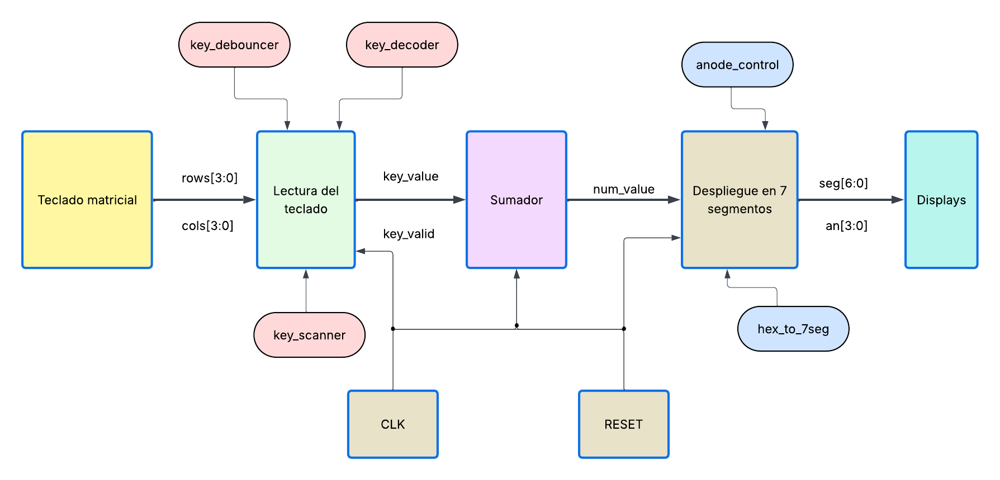

El diagrama de bloques muestra el flujo general del sistema. Primero, el teclado matricial interactúa con el subsistema de lectura del teclado mediante las señales `rows[3:0]` y `cols[3:0]`. Dentro de este subsistema se encuentran los módulos `key_scanner`, `key_decoder` y `key_debouncer`, encargados de escanear el teclado, decodificar la tecla presionada y validar la entrada para evitar rebotes.

Luego, el subsistema de lectura entrega al bloque sumador las señales `key_value` y `key_valid`. El sumador interpreta estas entradas para almacenar los operandos, cambiar de estado y generar el valor que debe mostrarse en pantalla mediante la señal `num_value`.

Finalmente, el subsistema de despliegue en el 7 segmentos recibe `num_value` y genera las señales `seg[6:0]` y `an[3:0]` hacia los displays. Este bloque incluye los módulos `hex_to_7seg` y `anode_control`, los cuales convierten cada dígito al patrón de segmentos correspondiente y seleccionan cuál display se activa durante el multiplexado.

## 4. Diagramas de estado de las FSM diseñadas.

En el diseño se utilizan varias lógicas secuenciales para controlar el flujo de datos del sistema. Las FSM principales se encuentran en el módulo del debouncer del teclado y en el controlador del sumador. Además, algunos módulos como el escáner del teclado y el controlador de ánodos funcionan como secuencias cíclicas simples.

### 4.1 FSM del antirrebote del teclado

El módulo `key_debouncer` se encarga de validar que una tecla presionada sea estable antes de generar la señal `valid`. Esto es necesario porque los botones mecánicos pueden generar rebotes, provocando varias transiciones rápidas cuando en realidad el usuario presionó una sola tecla.

Esta FSM utiliza tres estados principales. En el estado de reposo, el sistema espera a que se detecte una tecla presionada. Cuando se detecta una posible tecla, pasa a un estado de validación, donde verifica que el valor permanezca estable durante un tiempo determinado. Si la tecla se mantiene estable, se genera un pulso de `valid` y el sistema pasa a un estado de espera hasta que la tecla sea liberada. Una vez liberada, la FSM vuelve al estado inicial.

De forma resumida, el flujo es:

| Estado     | Función                                                   |
| ---------- | --------------------------------------------------------- |
| `IDLE`     | Espera la detección de una tecla.                         |
| `DEBOUNCE` | Verifica que la tecla permanezca estable.                 |
| `PRESSED`  | Espera a que la tecla sea liberada antes de aceptar otra. |

Esta FSM básicamente evita que una sola presión física sea interpretada como varias entradas digitales.

### 4.2 FSM del controlador del sumador

El módulo `sumador` tiene la lógica de control que permite decidir qué debe hacer el sistema con cada tecla validada. Esta FSM controla la captura del primer operando, la captura del segundo operando, la visualización del resultado y la visualización del overflow.

Los estados principales son:

| Estado       | Función                                |
| ------------ | -------------------------------------- |
| `NUM_A`      | Captura y muestra el primer operando.  |
| `NUM_B`      | Captura y muestra el segundo operando. |
| `SUM_C`      | Muestra el resultado de la suma BCD.   |
| `OVERFLOW_D` | Muestra el acarreo final de la suma.   |

Al iniciar el sistema, la FSM entra en el estado `NUM_A`, donde los dígitos presionados se almacenan en el primer operando. Cuando se presiona la tecla de control `B`, el sistema cambia al estado `NUM_B`, permitiendo ingresar el segundo operando. Al presionar la tecla `C`, la FSM cambia al estado `SUM_C`, donde se muestra el resultado de la suma. Finalmente, si se presiona la tecla `D`, el sistema pasa al estado `OVERFLOW_D`, donde se muestra el overflow (en caso de haber) de salida.

### 4.3 Secuencia de escaneo del teclado

El módulo `key_scanner` no se implementa como una FSM compleja, pero sí funciona como una secuencia cíclica. Su trabajo es activar una fila del teclado a la vez mediante la señal `rows[3:0]`. Mientras se activa una fila, el sistema revisa las columnas `cols[3:0]` para detectar si existe una tecla presionada.

La secuencia con la que se escanea es:

`Fila 0, Fila 1, Fila 2, Fila 3, Fila 0...`

Esto permite recorrer todo el teclado matricial de forma periódica. Cuando se detecta una tecla, el sistema puede identificarla a partir de la combinación entre la fila activa y la columna detectada.

### 4.4 Secuencia de multiplexado del display

El módulo `anode_control` también funciona como una secuencia cíclica. Su función es activar un display de 7 segmentos a la vez, mientras el módulo display selecciona el dígito correspondiente del número BCD.

La secuencia de activación es:

`Dígito 0, Dígito 1, Dígito 2, Dígito 3, Dígito 0...`

En cada paso se activa una salida diferente de `an[3:0]` y se coloca en `seg[6:0]` el patrón correspondiente al dígito seleccionado. Aunque físicamente solo un display se activa en cada instante, la conmutación ocurre lo suficientemente rápido para que el ojo humano perciba los cuatro dígitos encendidos al mismo tiempo.

## 5. Ejemplo y análisis de una simulación funcional del sistema completo
Para validar el funcionamiento general del sistema se realizó una simulación utilizando el módulo `top`. Esta simulación permite observar el recorrido completo de la información desde el estímulo de entrada generado sobre el teclado matricial con el debouncer, hasta la activación en los displays de 7 segmentos.

El sistema integrado está compuesto por tres subsistemas principales:

1. Subsistema de lectura del teclado hexadecimal.
2. Subsistema de almacenamiento y suma aritmética en BCD.
3. Subsistema de despliegue multiplexado en cuatro displays de 7 segmentos.

En el diseño, estos bloques se conectan dentro del módulo `top.sv` como de costumbre. El teclado entrega un valor de tecla validado, el sumador almacena los operandos y genera el valor que debe mostrarse, y finalmente el módulo de display convierte dicho valor en señales físicas para los ánodos y segmentos.

### 5.2 Simulación del Sistema
En el caso de prueba del sistema completo se simuló la presión de la tecla 1. Durante la simulación, el módulo `key_scanner` genera un barrido secuencial de las filas mediante la señal rows. Cuando la fila correspondiente se encuentra activa, el testbench coloca `cols = 4'b0001`, simulando de esta manera el cierre del contacto de la tecla.

El módulo `key_decoder` interpreta esta combinación como la tecla hexadecimal 1. Después, el módulo `key_debouncer` verifica que la tecla permanezca estable durante el tiempo requerido y genera un pulso en `key_valid`. En ese mismo momento, `key_value` toma el valor:

```systemverilog 
key_value = 4'h1
```

Este valor lo recibe  el `módulo sumador`, el cual lo almacena como parte del número actual. Como el sistema inicia en el estado de captura de la primera señal, el valor mostrado pasa a ser:

```systemverilog 
num_value = 16'h0001
```

Por lo tanto, el valor que debe desplegarse en los cuatro displays es:

```systemverilog 
0001
```
### 5.3 Manejo de los displays de 7 segmentos
El módulo `display` recibe el valor `num_value[15:0]` y lo divide en cuatro dígitos BCD. Para el caso `num_value = 16'h0001`, los nibbles son:

| Digito | Bit | Valor |
|---|---|---|
| Digito 0 | `num_value[3:0]` | 1 |
| Digito 1 | `num_value[7:4]` | 0 |
| Digito 2 | `num_value[11:8]` | 0 |
| Digito 3 | `num_value[15:12]` | 0 |

El módulo `clk_divider` genera un pulso tick que permite cambiar periódicamente el dígito activo. Luego, `anode_control` actualiza la señal `an[3:0]` para activar un display a la vez. Mientras tanto, el multiplexor interno del módulo display selecciona el nibble correspondiente y lo envía al decodificador `hex_to_7seg`.

Para el caso simulado, se puede observar la siguiente secuencia de multiplexado:

| `an[3:0]` | Nibble seleccionado | Valor mostrado | `seg[6:0]` esperado |
| --------- | ------------------- | -------------- | ------------------- |
| `4'b0001` | `num_value[3:0]`    | `1`            | `7'b1111001`        |
| `4'b0010` | `num_value[7:4]`    | `0`            | `7'b1000000`        |
| `4'b0100` | `num_value[11:8]`   | `0`            | `7'b1000000`        |
| `4'b1000` | `num_value[15:12]`  | `0`            | `7'b1000000`        |

Los patrones de `seg[6:0]` corresponden a lógica activa en bajo, es decir, un `0` enciende el segmento y un `1` lo apaga. Por esta razón, el número `1` se representa con `7'b1111001`, mientras que el número `0` se representa con `7'b1000000`.

### 5.4 Simulación del proceso de suma
Además de validar la ruta completa desde el teclado hasta el display, se verificó el funcionamiento del bloque aritmético mediante el testbench `sumador_tb.sv`. En esta prueba se ingresó el primer operando `12`, luego se cambió al segundo operando mediante la tecla de comando B, se ingresó el valor `9` y finalmente se solicitó la suma mediante la tecla C.

La secuencia de entrada fue:

```systemverilog 
1 y 2
Luego:
B
Y por último 
9 y C
```
Esto representa la operación: 

```systemverilog 
`12 + 9 = 21`
```
Durante la estas entradas se observó la siguiente evolución de las señales internas:

```systemverilog 
num_1   = 0000 a 0001 a 0012
num_2   = 0000 a 0009
num_out = 0000 a 0001 a 0012 a 0000 a 0009 a 0021
```

El resultado final fue:
```systemverilog 
num_out = 16'h0021
```

Esto confirma que el bloque aritmético almacena correctamente los dos operandos y realiza la suma en formato BCD. El resultado `0021` puede ser enviado al módulo `display`, donde se mostraría como `0021` mediante el mismo mecanismo de multiplexado descrito anteriormente.

### 5.5 Análisis general de la simulación

Esta simulación permite verificar que los subsistemas principales se encuentran correctamente interconectados. Primero, el teclado es estimulado mediante señales equivalentes a una presión física. Luego, el bloque de lectura realiza el escaneo, la decodificación y la validación de la tecla. Después, el valor validado se entrega al sumador, donde se almacena o se utiliza como comando de control. Finalmente, el número actual se envía al sistema de visualización.

En la salida del sistema, las señales `an[3:0] y seg[6:0]` permiten comprobar que el valor procesado se transforma en señales compatibles con displays de 7 segmentos. El sistema no enciende los cuatro displays al mismo tiempo, sino que activa uno por uno a alta velocidad. Este proceso de multiplexado permite mostrar un número de cuatro dígitos usando un único bus de segmentos compartido.

Con base en los resultados obtenidos, se concluye que la simulación valida la ruta funcional completa del diseño va del teclado matricial hacia la decodificación, luego al antirrebote, después se suma en BCD, de ahí al multiplexado y por último al 7 segmentos.

Por lo tanto, se puede comprobar que el sistema cumple funcionalmente con el flujo esperado: recibir datos desde un teclado hexadecimal, procesarlos internamente y generar las señales necesarias para desplegar el valor en cuatro displays de 7 segmentos.    

### Testbench del Sumador
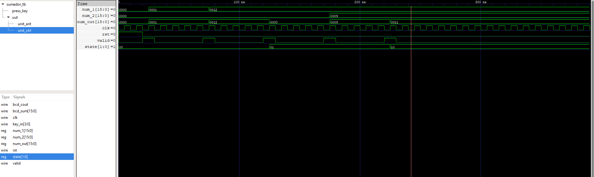

## 6 Análisis de Consumo de Recursos en la FPGA y Consumo de Potencia

Para analizar el consumo de recursos del diseño se utilizaron los reportes generados por las herramientas de síntesis y de ruteo. En este caso se revisaron los archivos `synthesis_tangnano9k.log` y `pnr_tangnano9k.log`, obtenidos después de ejecutar los comandos:

```bash
make synth
make pnr
```

### 6.1  Recursos reportados por el pnr
El archivo `pnr_tangnano9k.log` reportó la siguiente utilización del dispositivo:

| Recurso     | Utilizado | Disponible | Porcentaje |
| ----------- | --------: | ---------: | ---------: |
| `SLICE`     |       783 |       8640 |         9% |
| `IOB`       |        21 |        274 |         7% |
| `MUX2_LUT5` |       149 |       4320 |         3% |
| `MUX2_LUT6` |        70 |       2160 |         3% |
| `MUX2_LUT7` |        33 |       1080 |         3% |
| `MUX2_LUT8` |        14 |       1056 |         1% |
| `RAMW`      |         0 |        270 |         0% |
| `ODDR`      |         0 |        274 |         0% |
| `OSC`       |         0 |          1 |         0% |

Teniedo estos resultados en mente, se puede concluir que el diseño utiliza una cantidad baja de recursos de la FPGA. El recurso principal utilizado son los SLICE, con un consumo de 783 de 8640 disponibles, equivalente al 9% del dispositivo. También se utilizan 21 pines de entrada/salida (constraints) de los 274 disponibles, lo que representa un 7%.

### 6.2 Recursos reportados por síntesis
El archivo `synthesis_tangnano9k.log` reportó para el módulo principal top un total de 1104 celdas. Las más relevantes fueroin:

| Celda       | Cantidad | Función aproximada                                             |
| ----------- | -------: | -------------------------------------------------------------- |
| `ALU`       |      162 | Recursos asociados a operaciones aritméticas y lógica de suma. |
| `DFFC`      |       34 | Flip-flops con control.                                        |
| `DFFCE`     |       82 | Flip-flops con clock enable y control.                         |
| `DFFP`      |        1 | Flip-flop adicional con preset/control.                        |
| `LUT1`      |      322 | Lógica combinacional simple.                                   |
| `LUT2`      |       71 | Lógica combinacional de dos entradas.                          |
| `LUT3`      |       71 | Lógica combinacional de tres entradas.                         |
| `LUT4`      |       72 | Lógica combinacional de cuatro entradas.                       |
| `MUX2_LUT5` |      149 | Multiplexores y lógica combinacional más amplia.               |
| `MUX2_LUT6` |       70 | Multiplexores y lógica combinacional más amplia.               |
| `MUX2_LUT7` |       33 | Multiplexores y lógica combinacional más amplia.               |
| `MUX2_LUT8` |       14 | Multiplexores y lógica combinacional más amplia.               |
| `IBUF`      |        6 | Buffers de entrada.                                            |
| `OBUF`      |       15 | Buffers de salida.                                             |

A partir de los flip-flops reportados en la anterior tabla, el diseño utiliza aproximadamente: 

```bash
DFFC + DFFCE + DFFP = 34 + 82 + 1 = 117 flip-flops
```

Estos flip-flops corresponden principalmente a registros internos, estados de máquinas de estado, contadores, sincronización de entradas y almacenamiento de datos.

### 6.3 Interpretación del consumo de recursos

El consumo de LUTs y multiplexores se debe principalmente a la lógica combinacional que usó en el sistema. Esta incluye la decodificación del teclado, la lógica de control del sumador, la suma BCD, los multiplexores internos y el decodificador hacia el 7 segmentos.

El uso de flip-flops se debe a los elementos secuenciales del diseño. Entre ellos se encuentran los registros utilizados para almacenar los operandos, los estados internos de control, el contador del debouncer, el divisor de reloj y la lógica de multiplexado del display.

El uso de pines de entrada/salida (constraints) se debe a las señales externas del sistema, incluyendo el reloj, reset, entradas y salidas del teclado, ánodos de los displays y segmentos.

En conclusión, el diseño utiliza una fracción pequeña de la FPGA Tang Nano 9K, mostrado en que el consumo de SLICE es de apenas 9%.

## 8 Reporte de velocidades máximas de reloj posibles en el diseño

Para verificar la velocidad máxima de operación del diseño se revisó el reporte generado por `nextpnr-gowin` después del pnr. Esta etapa permite estimar si el circuito puede funcionar correctamente a la frecuencia de reloj requerida por el proyecto.

El archivo `pnr_tangnano9k.log` reportó el siguiente resultado para el reloj principal del sistema:

```bash
Max frequency for clock 'display_inst.clk': 95.26 MHz (PASS at 27.00 MHz)
```

Esto significa que, según el análisis de temporizado realizado por nextpnr-gowin, el diseño podría operar hasta una frecuencia aproximada de 95.26 MHz. Como la frecuencia mínima requerida para el proyecto es de 27 MHz se cumple la condición de operación del diseño.

### 7. Análisis de principales problemas hallados durante el trabajo y de las soluciones aplicadas.


Durante el desarrollo del proyecto, uno de los principales problemas encontrados fue la transición entre la implementación en código y el funcionamiento físico del circuito. Esta dificultad se presentó especialmente en el manejo del teclado matricial, ya que no solo era necesario describir su lógica, sino también verificar correctamente su conexión física, el barrido de filas y columnas, y la interpretación de cada tecla presionada.

Uno de los problemas más recurrentes fue la implementación del módulo de `debouncer`. En varias pruebas, el sistema no lograba detectar de forma estable las teclas, o generaba múltiples pulsos para una sola presión. Para solucionarlo, se revisó la lógica de validación de la tecla, se ajustaron los tiempos de espera y se realizaron pruebas separadas del teclado antes de integrarlo con el resto del sistema.

Además, una mala división inicial de tareas provocó que se invirtiera más tiempo del necesario en el montaje físico del circuito. En varias ocasiones fue necesario volver a armar o revisar conexiones, lo que retrasó el avance del proyecto. Como solución, se reorganizó el trabajo del grupo, se separaron mejor las responsabilidades entre diseño, simulación, montaje y pruebas, y se documentaron con mayor cuidado las conexiones utilizadas.

En general, estos problemas permitieron comprender mejor la importancia de verificar cada subsistema por separado antes de integrarlo al sistema completo. También evidenciaron la necesidad de una mejor planificación del trabajo en equipo y de una documentación clara para evitar repetir errores durante el montaje y las pruebas físicas.

## Ejercicios 

### Ejercicio 1: Contadores Sincrónicos 74LS163.

En este ejercicio se utilizó un contador utilizando dos circuitos integrados 74LS163 conectados en cascada. La señal de reloj fue generada desde la FPGA y las salidas fueron medidas con el osciloscopio configurado como analizador lógico.

El objetivo fue verificar el conteo binario, la conexión en cascada entre los contadores, el comportamiento de la salida `RCO` y el tiempo de propagación entre el reloj y una salida del contador.

Para la realización de este ejercicio se trabajó en conjunto con otra pareja por la necesidad de usar dos integrados.

### Funcionamiento normal del contador

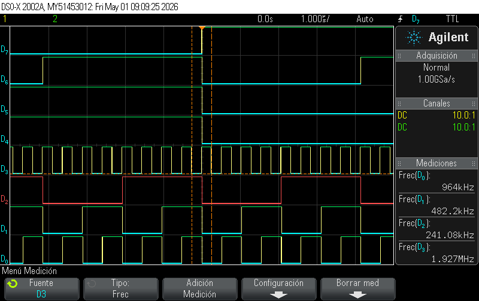

En esta medición se observa el comportamiento esperado de un contador binario. Las salidas cambian de forma periódica y cada bit divide la frecuencia del bit anterior. Esto confirma que el contador avanza correctamente con cada flanco activo del reloj.

### Medición del tiempo de propagación CLK-QA

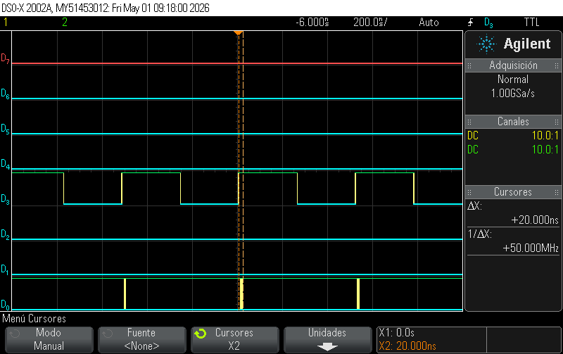

Se midió el retardo entre el flanco activo del reloj y el cambio en la salida `QA`. Con los cursores del osciloscopio se obtuvo un tiempo aproximado de:
```text
t_pCLK-QA ≈ 20 ns
```
Este retardo corresponde al tiempo que tarda el flip-flop interno del contador en actualizar su salida después del flanco de reloj.

### Verificación de cascada con dos contadores

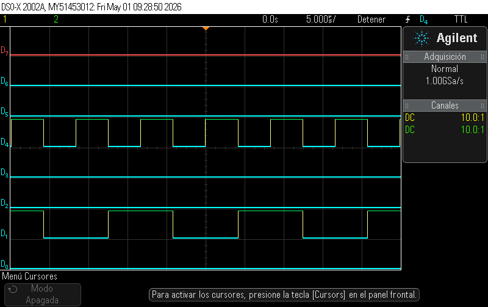

En esta parte se verificó la conexión en cascada entre dos contadores. El primer contador genera los bits menos significativos y, cuando completa su ciclo de conteo, activa la señal RCO. Esta señal permite habilitar el avance del segundo contador.

De esta forma, dos contadores de 4 bits pueden trabajar juntos como un contador de mayor cantidad de bits.

### Medición de RCO
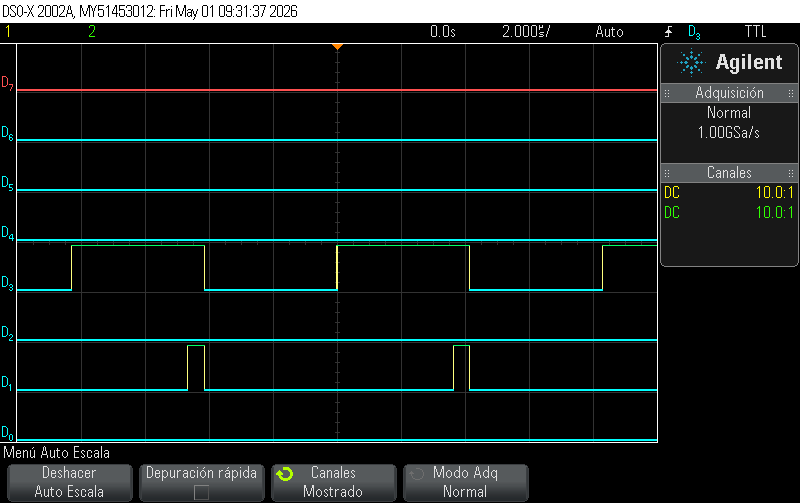

En esta medición se observó la salida `RCO`. La señal aparece únicamente cuando el contador alcanza su valor terminal, por lo que se comporta como un pulso de overflow hacia el siguiente contador.

### Glitches en RCO
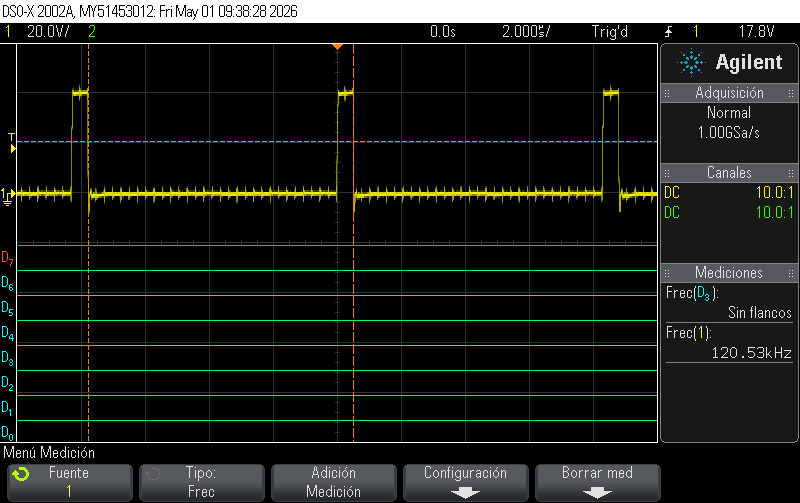

Se observó la señal `RCO` buscando posibles glitches. Estos pulsos muy cortos pueden aparecer porque RCO se genera a partir de lógica combinacional interna. Cuando varios bits del contador cambian casi al mismo tiempo se pueden generar pequeños retardos internos que producen pulsos no deseados. Este fenómeno es más probable durante transiciones donde cambian varios bits.

## Ejercicio 2: Construcción de un cerrojo Set-Reset con compuertas NAND

En este ejercicio se construyó un cerrojo Set-Reset sincronizado por reloj utilizando compuertas NAND. El circuito se basó en la configuración clásica de un SR clocked latch, donde las entradas `S` y `R` solo afectan la salida cuando la señal de reloj se encuentra activa. Cabe aclarar que nuevamente se trabajó con otra pareja para la realización de este ejercicio.

Como referencia se consultó la sección **Clocked SR Flip Flop Using NAND Gate** de CircuitDigest [1], donde se explica que el circuito utiliza compuertas NAND para controlar las entradas `Set` y `Reset` mediante una señal de reloj, permitiendo que el estado de salida cambie únicamente cuando el reloj habilita el circuito. 

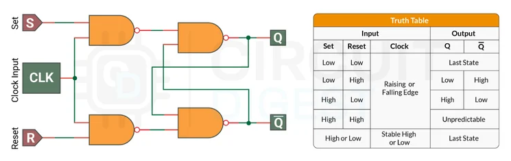

El cerrojo SR posee dos entradas principales: `S` para establecer la salida y `R` para reiniciarla. También posee una entrada de reloj `CLK`, la cual habilita o bloquea el efecto de las entradas.

| `S` | `R` | `CLK` | `Q` |
|---|---|---|---|
| 0 | 0 | 1 | Estado anterior | 
| 1 | 0 | 1 | 1 | Set |
| 0 | 1 | 1 | 0 | Reset |
| 1 | 1 | 1 | Indeterminado |
| X | X | 0 | Estado anterior |

Cuando `CLK = 0`, las entradas quedan bloqueadas y el circuito mantiene su último estado. Cuando `CLK = 1`, el cerrojo responde a las entradas `S` y `R`.

### Medición de la señal de reloj
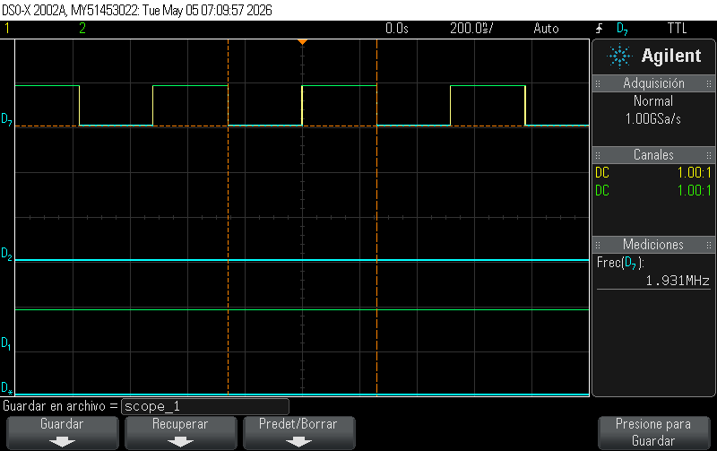

En esta captura se observa la señal de reloj utilizada para habilitar el cerrojo. Aquí se usó el canal D1 para Q y D2 para Q negado. La frecuencia medida fue aproximadamente:

```text
fCLK ≈ 1.93 MHz
```
Esta señal controla cuándo el cerrojo puede actualizar su salida.

### Respuesta del cerrojo ante cambios de entrada
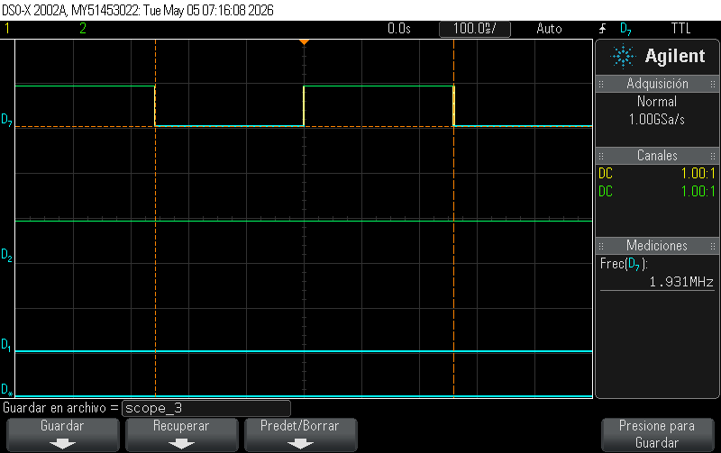

En esta medición se observa el comportamiento de la salida del cerrojo ante cambios en las entradas `S` y `R`. Como se puede observar, la salida no cambia en cualquier momento, sino solamente cuando la señal de reloj `CLK` habilita el circuito. Esto confirma que el cerrojo SR implementado no trabaja de forma completamente asíncrona, ya que su actualización depende del estado de la señal de reloj.

### Verificación con señales Set y Reset
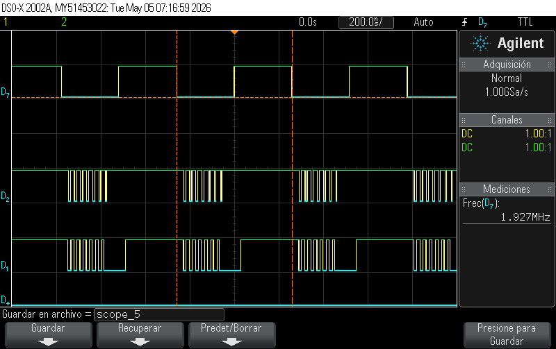

En esta medición se observa la respuesta del circuito ante las condiciones de `Set` y `Reset`.

Cuando se activa `S` y a su vez `R` permanece desactivado, la salida `Q` pasa a estado alto. Cuando se activa `R` y a su vez `S` permanece desactivado, la salida `Q` pasa a estado bajo.

También se observa que, cuando no existe una nueva condición válida de set o reset, el circuito conserva su estado anterior. Esto demuestra la propiedad de memoria del cerrojo SR.


## Referencias

[1] CircuitDigest, “Clocked SR Flip-Flop: Truth Table, Circuit Diagram, Working,” *CircuitDigest*, Jul. 22, 2025. [En línea]. Disponible en: https://circuitdigest.com/electronic-circuits/clocked-sr-flip-flop-truth-table-circuit-diagram-working. [Accedido: Mayo 15, 2026].


